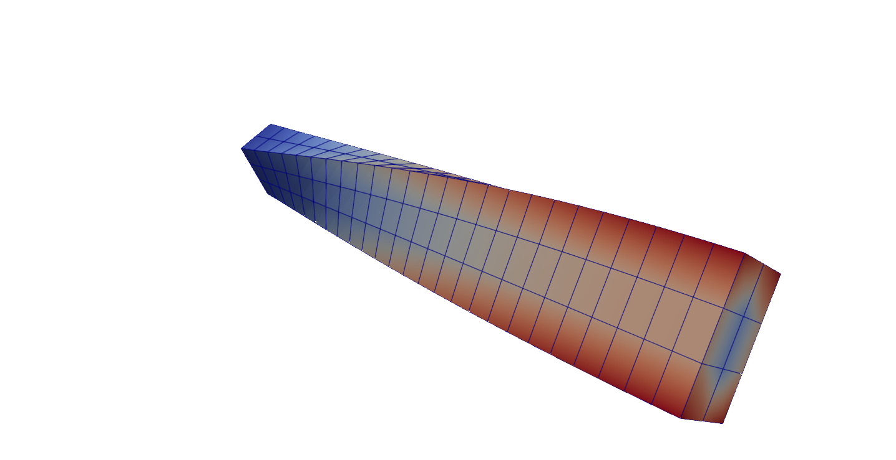

.. _Target_ModalGA:

Example Using SciPy and SLEPc  for a Real Eigenvalue Problem
------------------------------------------------------------

Problem
.......

We analyze a beam-like structure clamped at one end, assuming a linear elastic material.
This example demonstrates the use of the SciPy sparse solver as an alternative to,
or in conjunction with, SLEPc.

   Fourth eigenmode  of the beam-like structure clamped at one end (Paraview).
   The color corresponds to the magnitude of the displacement vector

Details of the Python Script
............................

.. note::
   You can download the complete python script
   :download:`TestModal.py <codeGA/TestModal.py>`

**Import required libraries**

.. literalinclude:: codeGA/TestModal.py
   :lines: 8-22

This section imports the necessary libraries:

* dolfinx: For finite element computation.
* petsc4py and slepc4py: Interfaces for PETSc and SLEPc libraries for solving eigenvalue problems.
* scipy.sparse: For sparse matrix operations and solving eigenvalue problems with SciPy.

**Define PETSc to SciPy Conversion Function**

.. literalinclude:: codeGA/TestModal.py
   :lines: 23-32

This function takes a PETSc sparse matrix and converts it to the SciPy csr_matrix format. This conversion is essential for compatibility when using SciPy's eigenvalue solvers.

**Define the Computational Domain and Mesh**

.. literalinclude:: codeGA/TestModal.py
   :lines: 33-39

This block defines a 3D rectangular domain with dimensions [5, 0.6, 0.4] and a resolution of [25, 3, 2]. The mesh is created using Dolfinx and distributed across processors.

**Define Material Properties and Constitutive Laws**

.. literalinclude:: codeGA/TestModal.py
   :lines: 40-51

Defines material properties (Young's modulus E, Poisson's ratio nu, density rho) and constitutive relationships for
linear elasticity:

* epsilon(u): Symmetric gradient (strain tensor).
* sigma(u): Stress tensor using the Lamé constants.

**Define Function Space and Boundary Conditions**

.. literalinclude:: codeGA/TestModal.py
   :lines: 52-66

* Creates a finite element function space for vector-valued functions.
* Implements Dirichlet boundary conditions (fixed at x=0).

**Assemble Stiffness and Mass Matrices**

.. literalinclude:: codeGA/TestModal.py
   :lines: 67-78

Constructs stiffness (K) and mass (M) matrices  from variational forms.

**Solve Eigenvalue Problem with SciPy**

.. literalinclude:: codeGA/TestModal.py
   :lines: 79-87

Converts the PETSc matrices to SciPy format and solves the generalized eigenvalue problem using the SciPy eigsh solver. The eigenvalues are converted to natural frequencies.

**Solve Eigenvalue Problem with SLEPc**

.. literalinclude:: codeGA/TestModal.py
   :lines: 88-114

* Configures and solves the eigenvalue problem using SLEPc.
* Applies spectral transformation (SINVERT) for improved convergence.

**Output Results and Compare**

.. literalinclude:: codeGA/TestModal.py
   :lines: 115-

* Writes eigenvectors to an XDMF file for visualization.
* Compares the frequencies computed by SciPy and SLEPc. The results are printed for each mode.

.. note::
   In case of an error  message try first **source dolfinx-real-mode** in your
   Docker environment.
